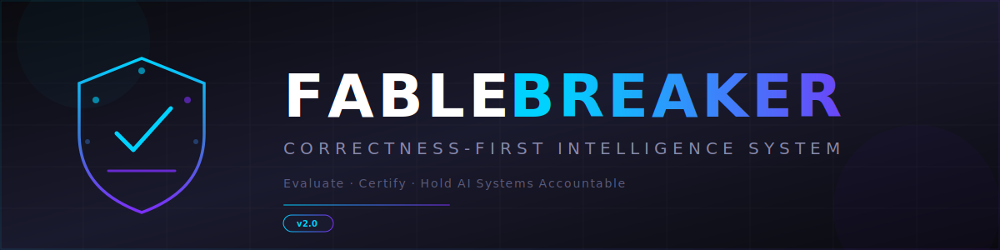

<p align="center">
  
</p>

<p align="center">
  <strong>The correctness-first intelligence system that evaluates, certifies, and holds AI systems accountable.</strong>
</p>

<p align="center">
  <a href="https://github.com/ItsNotAILABS/FABLEBREAKER-BENCHMARK/actions/workflows/pylint.yml"></a>
  <a href="https://github.com/ItsNotAILABS/FABLEBREAKER-BENCHMARK"></a>
  <a href="https://github.com/ItsNotAILABS/FABLEBREAKER-BENCHMARK"></a>
  <a href="LICENSE"></a>
  <a href="GOVERNANCE.md"></a>
  <a href="https://doi.org/10.5281/zenodo.20589250"></a>
</p>

<p align="center">
  <a href="#architecture"></a>
  <a href="#benchmark-ingestion"></a>
  <a href="#certification-protocol"></a>
  <a href="https://github.com/ItsNotAILABS/FABLEBREAKER-BENCHMARK"></a>
  <a href="#research-journal"></a>
  <a href="PRODUCT_STRATEGY.md"></a>
</p>

---

## What Is Fablebreaker?

**Fablebreaker is not a benchmark.** It is a **correctness-first intelligence system** — a sovereign evaluation infrastructure that holds AI systems accountable through adversarial certification, formal governance, emergent behavior detection, and cryptographic proof chains.

Benchmarks are **data that Fablebreaker consumes**. Every major AI evaluation dataset — MMLU, HumanEval, GPQA, ARC, HellaSwag, BigBench, SWE-bench, MLPerf, and more — is an input to the Fablebreaker Intelligence, not a peer. Fablebreaker ingests these benchmarks as knowledge, synthesizes their signals, and produces something none of them can offer alone:

> **A certified, adversarial, governance-backed judgment on whether an AI system's claims are true.**

---

## Why Fablebreaker Exists

The AI evaluation landscape is broken:

| Problem | What Fablebreaker Does |
|---------|----------------------|
| Benchmarks reward speed over correctness | **Correctness gates everything** — zero certification without semantic proof |
| Results are self-reported and unfalsifiable | **Adversarial hidden-seed evaluation** — claims survive or die against secret test corpora |
| No accountability for false claims | **Governance + certification authority** — disputed results undergo formal arbitration |
| Benchmarks are narrow and gameable | **Multi-benchmark ingestion** — Fablebreaker synthesizes across all known benchmarks |
| No emergent behavior detection | **Protocol-driven anomaly detection** — identifies when systems game evaluations |

---

## Architecture

<p align="center">

```
┌─────────────────────────────────────────────────────────────────────────────┐
│                      FABLEBREAKER INTELLIGENCE SYSTEM                         │
├─────────────────────────────────────────────────────────────────────────────┤
│                                                                             │
│  ┌─────────────────────────────────────────────────────────────────────┐    │
│  │                    BENCHMARK INGESTION LAYER                         │    │
│  │  MMLU · HumanEval · GPQA · ARC · HellaSwag · BigBench · SWE-bench  │    │
│  │  MLPerf · TruthfulQA · GSM8K · MATH · WinoGrande · ...             │    │
│  └──────────────────────────────┬──────────────────────────────────────┘    │
│                                 │                                           │
│                                 ▼                                           │
│  ┌──────────────┐   ┌──────────────────┐   ┌───────────────────────┐       │
│  │  FOUNDATIONS  │   │    PROTOCOLS     │   │   RULES ENGINE        │       │
│  │  AST Language │   │  14 Published    │   │  Correctness Gates    │       │
│  │  Formal Spec  │   │  Adversarial Gen │   │  Semantic Equivalence │       │
│  │  Type System  │   │  Scoring Methods │   │  Hash Verification    │       │
│  └──────┬───────┘   └────────┬─────────┘   └──────────┬────────────┘       │
│         │                    │                         │                    │
│         ▼                    ▼                         ▼                    │
│  ┌────────────────────────────────────────────────────────────────────┐     │
│  │                   CERTIFICATION LAYER                               │     │
│  │  Evidence Packs · SHA-256 Locking · Hidden-Seed Verification       │     │
│  │  Governance Sign-off · Dispute Resolution · Non-Repudiation        │     │
│  └────────────────────────────────────────────────────────────────────┘     │
│                                 │                                           │
│                                 ▼                                           │
│  ┌────────────────────────────────────────────────────────────────────┐     │
│  │                   GOVERNANCE & ACCOUNTABILITY                       │     │
│  │  Role-Based Authority · Seed Authority · Audit Trails              │     │
│  │  Emergent Behavior Detection · Anomaly Flagging · Formal Disputes  │     │
│  └────────────────────────────────────────────────────────────────────┘     │
│                                                                             │
└─────────────────────────────────────────────────────────────────────────────┘
```

</p>

---

## Core Pillars

### 🔬 Foundations

The formal specification layer that defines what correctness means:

- **AST Language** — 18+ operations including `if_zero`, `neg`, `abs`, `sub`, `band`, `bor`, `fold_list`, `seq`
- **Type System** — Strict expression grammar under evaluation
- **Formal Semantics** — Deterministic evaluation with canonical serialization

### 🛡️ Protocols (14 Published)

Peer-reviewed protocols that govern every aspect of evaluation:

- **Adversarial Generation** — Overflow corridors, conditional cascades, erasure traps
- **Scoring Methods** — Per-family breakdown with 95% confidence intervals
- **Reproducibility** — Identical seed → identical dataset on any conforming platform
- **Governance Certification** — Evidence chain creation with maintainer sign-off

### ⚖️ Rules Engine

The enforcement layer that makes correctness non-negotiable:

- **Correctness Gate** — Single incorrect output = zero certification
- **Semantic Equivalence** — SHA-256 hash of canonical serialization
- **Hidden-Seed Protocol** — Secret corpora never exposed to candidates
- **Non-Repudiation** — Cryptographic proof chains prevent forgery

### 🏛️ Governance

Formal authority structure ensuring integrity:

- **Seed Authority** — Hardware entropy, pre-committed hashes, post-evaluation reveal
- **Dispute Resolution** — Formal arbitration within 14 days
- **Role-Based Access** — Maintainers, reviewers, contributors with defined authority
- **Amendment Process** — Transparent governance changes with notice periods

### 🧠 Emergent Behavior Detection

Identifying when AI systems attempt to game evaluations:

- **Anomaly Flagging** — Detects patterns indicating benchmark-specific optimization
- **Cross-Benchmark Correlation** — Identifies systems that overfit to known test sets
- **Behavioral Drift Monitoring** — Tracks score patterns across version releases

---

## Benchmark Ingestion

Fablebreaker treats all existing AI benchmarks as **input data** — knowledge to be consumed, synthesized, and built upon:

| Benchmark | Domain | Role in Fablebreaker |
|-----------|--------|---------------------|
| **MMLU** | Multi-task language understanding | Knowledge breadth signal |
| **HumanEval** | Code generation | Functional correctness baseline |
| **GPQA** | Graduate-level Q&A | Expert reasoning signal |
| **ARC** | Abstract reasoning | Pattern recognition baseline |
| **HellaSwag** | Commonsense reasoning | Coherence signal |
| **BigBench** | Diverse capabilities | Multi-dimensional capability map |
| **SWE-bench** | Software engineering | Real-world code understanding |
| **MLPerf** | ML performance | Hardware/throughput baseline |
| **TruthfulQA** | Truthfulness | Hallucination detection signal |
| **GSM8K / MATH** | Mathematical reasoning | Formal reasoning baseline |
| **WinoGrande** | Coreference resolution | Language understanding signal |

> These benchmarks measure **individual capabilities**. Fablebreaker synthesizes them into a **holistic accountability judgment** backed by adversarial certification.

---

## Certification Protocol

```
┌─────────────────────────────────────────────────────────────┐
│  1. PUBLIC EVALUATION        Known dataset, open scoring     │
├─────────────────────────────────────────────────────────────┤
│  2. HIDDEN-SEED CHALLENGE    Secret corpus, adversarial gen  │
├─────────────────────────────────────────────────────────────┤
│  3. HASH VERIFICATION        SHA-256 lock, zero tolerance    │
├─────────────────────────────────────────────────────────────┤
│  4. GOVERNANCE SIGN-OFF      Maintainer review + evidence    │
├─────────────────────────────────────────────────────────────┤
│  5. CERTIFICATION ISSUED     Cryptographic proof chain       │
└─────────────────────────────────────────────────────────────┘
```

**Zero-tolerance policy:** A single incorrect output on any hidden test case disqualifies the candidate — regardless of measured performance.

---

## Quick Start

### Run the Full Audit

```bash
cd fablebreaker
python tools/run_full_audit.py --candidate candidates.baseline_candidate
```

### Launch the Intelligence Service

```bash
python fablebreaker_service.py --host 127.0.0.1 --port 8787 --log-level INFO
```

### Verify the Service (Versioned API)

```bash
curl http://127.0.0.1:8787/api/v1/health
curl http://127.0.0.1:8787/api/v1/manifest
curl http://127.0.0.1:8787/api/v1/status
curl http://127.0.0.1:8787/api/v1/candidates
curl http://127.0.0.1:8787/api/v1/families
```

### Submit a Candidate for Certification

```bash
curl -X POST http://127.0.0.1:8787/api/v1/score \
  -H "Content-Type: application/json" \
  -d '{"candidate": "candidates.baseline_candidate", "dataset": "dataset/public.jsonl"}'
```

---

## Protocol SDK

All 14 published protocols are available as importable Python modules:

```python
from fablebreaker.protocols import (
    OverflowCorridorProtocol,         # Adversarial overflow corridor generation
    ConditionalCascadeProtocol,       # Nested conditional cascade generation
    GovernanceCertificationProtocol,  # Governance-aware evidence chains
    PerFamilyScoringProtocol,         # Per-family scoring with confidence intervals
    APIReproducibilityProtocol,       # HTTP API client for automation
    ProtocolRegistry,                 # Registry of all 14 papers and SDK bindings
    FOUNDATION_DOI,                   # "10.5281/zenodo.20589250"
)
```

---

## Research Journal

Fablebreaker publishes peer-reviewed research across five principal journals:

| Journal | Focus Area | Papers |
|---------|------------|--------|
| **[Journal of Adversarial Evaluation](journal/adversarial-evaluation/index.html)** | Adversarial test generation and evaluator stress testing | 3 |
| **[Journal of Benchmark Architecture](journal/benchmark-architecture/index.html)** | Game-resistant evaluation system design | 3 |
| **[Journal of Certification Systems](journal/certification-systems/index.html)** | Cryptographic evidence, trust protocols, and governance | 3 |
| **[Journal of Semantic Preservation](journal/semantic-preservation/index.html)** | Formal verification of evaluator correctness | 2 |
| **[Journal of Reproducibility Methods](journal/reproducibility-methods/index.html)** | Deterministic generation, measurement, and API automation | 3 |

📄 **Foundation Paper:** [doi.org/10.5281/zenodo.20589250](https://doi.org/10.5281/zenodo.20589250)

📚 **[Browse the Full Journal →](journal/index.html)** · **[Editorial Board →](journal/editorial-board.html)**

---

## Project Structure

```
FABLEBREAKER/
├── assets/                          # Brand assets (logos, banners)
├── fablebreaker/                    # Core intelligence system
│   ├── fablebreaker/                # Evaluator, generator, scorer
│   │   └── protocols/              # Protocol SDK (14 implementations)
│   ├── candidates/                  # Candidate implementations
│   ├── dataset/                     # Generated datasets (JSONL)
│   ├── reports/                     # Certification outputs
│   ├── tests/                       # Integrity tests
│   └── tools/                       # Audit and utility scripts
├── benchmark-certification/         # Certification infrastructure
│   ├── suites/                      # Suite implementations
│   ├── services/                    # HTTP service layer
│   ├── certification/               # Evidence and manifests
│   └── manifests/                   # Configuration manifests
├── journal/                         # Research publications (14 papers)
│   ├── adversarial-evaluation/      # 3 papers
│   ├── benchmark-architecture/      # 3 papers
│   ├── certification-systems/       # 3 papers
│   ├── semantic-preservation/       # 2 papers
│   └── reproducibility-methods/     # 3 papers
├── GOVERNANCE.md                    # Formal governance model
├── PACKET_POLICY.md                 # Production packet requirements
├── PRODUCT_STRATEGY.md              # Strategic positioning
├── benchmark-manifest.json          # Suite registry
└── evidence-pack-template.json      # Evidence pack schema
```

---

## Design Principles

| # | Principle | Description |
|---|-----------|-------------|
| 1 | **Correctness Is Non-Negotiable** | No claim is valid without hash-verified semantic equivalence |
| 2 | **Adversarial by Default** | Hidden seeds, erasure traps, deep nesting, overflow cases are standard |
| 3 | **Reproducibility Guaranteed** | Identical seed → identical dataset on any conforming platform |
| 4 | **Transparency of Method** | Generator, scorer, and reference evaluator are open source and auditable |
| 5 | **Cryptographic Integrity** | SHA-256 hash locking prevents forgery and ensures non-repudiation |
| 6 | **Governance Over Opinion** | Formal authority model, not community votes, decides certification |
| 7 | **Benchmarks Are Inputs** | External benchmarks are data consumed by Fablebreaker, not peers |

---

## Candidate Contract

Any candidate module must expose:

```python
def evaluate(expr: dict) -> object:
    """
    Evaluate a Fablebreaker AST expression and return the computed value.
    
    The returned value must be semantically identical to the reference evaluator's
    output for the same input. Verification is performed via SHA-256 hash of the
    canonical serialization.
    """
    ...
```

---

## Contributing

Candidates, adversarial families, protocols, and scoring improvements are accepted via pull request. All submissions must:

1. Pass the full audit pipeline
2. Maintain hash integrity across public and hidden datasets
3. Conform to the [Governance Model](GOVERNANCE.md)
4. Follow the [Packet Policy](PACKET_POLICY.md) for release artifacts

---

## License

This project is licensed under the terms specified in [LICENSE](LICENSE).

---

<p align="center">
  
</p>

<p align="center">
  <strong>ItsNotAI LABS</strong><br>
  <em>Correctness before claims. Certification before trust. Accountability before adoption.</em>
</p>

<p align="center">
  <sub>Fablebreaker is a correctness-first intelligence system. Benchmarks are data it consumes — not what it is.</sub>
</p>
